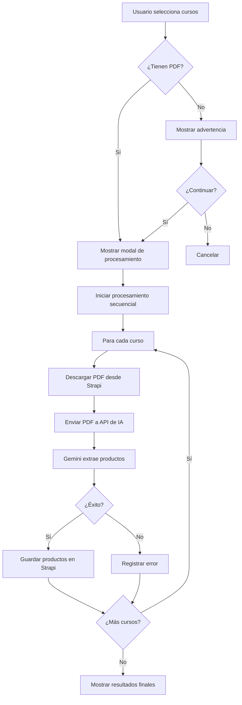

# 🤖 Documentación: Procesamiento Masivo de PDFs con IA (Gemini)

**Fecha:** 30 de enero de 2026  
**Versión:** 1.0  
**Estado:** ✅ Implementado y funcional

---

## 📋 Descripción General

Esta funcionalidad permite procesar múltiples PDFs de listas de útiles escolares simultáneamente usando **Google Gemini AI** para extraer automáticamente los productos de cada lista.

### 🎯 Ubicación

```
URL: /crm/listas/colegio/[colegioId]
Ejemplo: http://localhost:3000/crm/listas/colegio/egybos0bltkhnupq93fbwnii
```

### 🔑 Características Principales

- ✅ Selección múltiple de cursos mediante checkboxes
- ✅ Procesamiento masivo con un solo clic
- ✅ Extracción automática de productos usando IA (Gemini)
- ✅ Progreso en tiempo real con barra visual
- ✅ Resultados individuales por cada curso procesado
- ✅ Filtrado automático de cursos sin PDF
- ✅ Manejo de errores individual por curso
- ✅ Procesamiento secuencial para evitar saturación

---

## 🚀 Cómo Usar

### Paso 1: Seleccionar Cursos

1. Navega a `/crm/listas/colegio/[colegioId]`
2. Usa los checkboxes para seleccionar uno o más cursos
3. Solo los cursos con PDF asociado pueden ser procesados

### Paso 2: Iniciar Procesamiento

1. Una vez seleccionados los cursos, aparecerá una barra de acciones
2. Haz clic en el botón **"⚡ Procesar con IA"** (botón amarillo)
3. Si algunos cursos no tienen PDF, se mostrará una advertencia

### Paso 3: Monitorear Progreso

El modal de procesamiento mostrará:

- **Barra de progreso total**: Porcentaje completado
- **Curso actual**: Nombre del curso siendo procesado
- **Lista de resultados**: Estado de cada curso

#### Estados Posibles:

| Estado | Badge | Descripción |
|--------|-------|-------------|
| **Pendiente** | 🔵 Gris | Curso en cola esperando procesamiento |
| **Procesando** | 🔄 Azul | IA extrayendo productos del PDF |
| **Éxito** | ✅ Verde | Productos extraídos correctamente |
| **Error** | ❌ Rojo | Falló el procesamiento |

### Paso 4: Revisar Resultados

Al finalizar:
- Cada curso mostrará cuántos productos fueron extraídos
- Los errores se detallan por curso
- Puedes cerrar el modal y recargar la página para ver los cambios

---

## 🔧 Detalles Técnicos

### Componente Principal

```
Archivo: src/app/(admin)/(apps)/crm/listas/colegio/[colegioId]/components/CursosColegioListing.tsx
```

### Flujo de Procesamiento



### APIs Utilizadas

#### 1. **GET `/api/crm/listas/pdf/[pdfId]`**
- **Propósito:** Descargar el PDF desde Strapi
- **Input:** ID del PDF
- **Output:** Blob del PDF

#### 2. **POST `/api/crm/cursos/import-pdf`**
- **Propósito:** Procesar PDF con IA Gemini y extraer productos
- **Input:** 
  - FormData con el PDF
  - `cursoId`: ID del curso
  - `cursoDocumentId`: Document ID del curso
- **Output:**
  ```json
  {
    "success": true,
    "data": {
      "productos": [
        {
          "nombre": "Cuaderno universitario 100 hojas",
          "cantidad": "2",
          "especificaciones": "..."
        }
      ],
      "pdf_id": "123",
      "versionCreada": true
    }
  }
  ```

### Estados del Componente

```typescript
// Estados principales
const [showProcesarModal, setShowProcesarModal] = useState(false)
const [procesando, setProcesando] = useState(false)
const [progresoTotal, setProgresoTotal] = useState(0)
const [cursoActual, setCursoActual] = useState('')

// Resultados por curso
const [resultados, setResultados] = useState<Array<{
  curso: string
  cursoId: string | number
  pdfId: string | number
  status: 'pending' | 'processing' | 'success' | 'error'
  mensaje: string
  productosEncontrados?: number
}>>([])
```

### Función Principal: `procesarMasivamente()`

```typescript
const procesarMasivamente = async () => {
  // 1. Validar cursos seleccionados
  // 2. Filtrar cursos con PDF
  // 3. Inicializar modal y estados
  // 4. Procesar cada curso secuencialmente
  // 5. Actualizar progreso en tiempo real
  // 6. Mostrar resultados finales
}
```

---

## 📊 Estructura de Datos

### Entrada (Curso Seleccionado)

```typescript
{
  id: string | number
  documentId: string
  nombre: "1° Básico 2026"
  nivel: "Basica"
  año: 2026
  pdf_id: "abc123"  // Requerido para procesamiento
  pdf_url: "https://..."
  cantidadVersiones: 2
  matriculados: 45
}
```

### Salida (Resultado de Procesamiento)

```typescript
{
  curso: "1° Básico 2026"
  cursoId: "abc123"
  pdfId: "xyz789"
  status: "success"
  mensaje: "✓ 15 productos extraídos"
  productosEncontrados: 15
}
```

---

## 🎨 UI/UX

### Botón de Procesamiento

```tsx
<Button 
  variant="warning" 
  size="sm"
  onClick={procesarMasivamente}
  disabled={procesando}
  title="Procesar PDFs con IA (Gemini) para extraer productos automáticamente"
>
  <LuZap className="me-1" />
  {procesando ? 'Procesando...' : 'Procesar con IA'}
</Button>
```

**Características:**
- 🟨 Color amarillo para destacar
- ⚡ Icono de rayo (Zap) para indicar IA
- 🔒 Deshabilitado durante procesamiento
- 💡 Tooltip explicativo

### Modal de Progreso

**Elementos:**

1. **Header:**
   - Título: "Procesamiento Masivo con IA (Gemini)"
   - Icono de rayo
   - Botón cerrar (deshabilitado durante procesamiento)

2. **Body:**
   - **Barra de progreso total** (animada)
   - **Alerta de curso actual** (solo si está procesando)
   - **Lista de resultados** con estados visuales

3. **Footer:**
   - Botón "Cerrar" (solo si terminó)
   - Botón "Recargar Página" (solo si terminó)
   - Mensaje de espera (durante procesamiento)

---

## ⚠️ Manejo de Errores

### Errores Comunes y Soluciones

#### 1. **Curso sin PDF**

```
Error: Curso no tiene PDF asociado
Solución: Subir PDF al curso antes de procesar
```

#### 2. **Error al descargar PDF**

```
Error: Error al descargar PDF
Causas posibles:
- PDF eliminado de Strapi
- Problemas de conexión
- Permisos insuficientes
```

#### 3. **Error de IA (Gemini)**

```
Error: Error al procesar PDF con IA
Causas posibles:
- API key de Gemini inválida
- Límite de requests excedido
- PDF ilegible o corrupto
- Texto mal formateado
```

#### 4. **Error al guardar en Strapi**

```
Error: Error al guardar productos en Strapi
Causas posibles:
- Curso no existe
- Permisos insuficientes
- Campo versiones_materiales no válido
```

### Comportamiento ante Errores

- ✅ **Errores individuales NO detienen el procesamiento** de otros cursos
- ✅ Cada error se registra por separado
- ✅ El progreso continúa con el siguiente curso
- ✅ Al final se muestran todos los resultados (éxitos y errores)

---

## 🔒 Seguridad y Validaciones

### Validaciones del Frontend

1. ✅ Al menos 1 curso seleccionado
2. ✅ Cursos con PDF válido
3. ✅ Confirmación si hay cursos sin PDF
4. ✅ Modal bloqueado durante procesamiento

### Validaciones del Backend

1. ✅ Archivo es PDF válido
2. ✅ Tamaño máximo: 10MB
3. ✅ Curso existe en Strapi
4. ✅ PDF existe y es accesible
5. ✅ Token de Gemini válido

---

## 📈 Rendimiento

### Procesamiento Secuencial

**¿Por qué secuencial y no paralelo?**

- ✅ Evita saturar la API de Gemini
- ✅ Respeta límites de rate limiting
- ✅ Mejor tracking de progreso
- ✅ Menor probabilidad de errores
- ✅ Uso más eficiente de memoria

### Tiempos Estimados

| Cursos | Tiempo Estimado |
|--------|----------------|
| 1 curso | 10-15 segundos |
| 5 cursos | 50-75 segundos |
| 10 cursos | 1.5-2.5 minutos |
| 20 cursos | 3-5 minutos |

**Factores que afectan el tiempo:**
- Tamaño del PDF
- Cantidad de productos
- Complejidad del formato
- Velocidad de respuesta de Gemini
- Conexión a internet

---

## 🧪 Testing

### Casos de Prueba

#### ✅ Caso 1: Procesamiento Exitoso
```
Entrada: 3 cursos con PDF
Resultado esperado: 3 cursos procesados exitosamente
Validación: Productos extraídos y guardados en Strapi
```

#### ✅ Caso 2: Curso sin PDF
```
Entrada: 2 cursos con PDF + 1 sin PDF
Resultado esperado: Advertencia, procesa solo los 2 con PDF
Validación: 2 éxitos, 1 omitido
```

#### ✅ Caso 3: Error de IA
```
Entrada: 1 curso con PDF corrupto
Resultado esperado: Error registrado, procesamiento continúa
Validación: Status "error" en resultados
```

#### ✅ Caso 4: Interrupción del Usuario
```
Entrada: Usuario intenta cerrar modal durante procesamiento
Resultado esperado: Modal no se cierra
Validación: backdrop="static", closeButton deshabilitado
```

---

## 🔄 Flujo Completo - Ejemplo Real

### Escenario: Procesar 5 cursos de un colegio

```
1. Usuario navega a: /crm/listas/colegio/egybos0bltkhnupq93fbwnii
   ├─ Se muestran 12 cursos disponibles
   └─ 10 tienen PDF, 2 no tienen PDF

2. Usuario selecciona 5 cursos:
   ├─ 1° Básico 2026 (✓ PDF)
   ├─ 2° Básico 2026 (✓ PDF)
   ├─ 3° Básico 2026 (✓ PDF)
   ├─ 4° Básico 2026 (✗ Sin PDF)
   └─ 5° Básico 2026 (✓ PDF)

3. Usuario hace clic en "Procesar con IA"
   └─ Alert: "1 curso no tiene PDF y será omitido. ¿Continuar?"

4. Usuario confirma
   └─ Modal se abre con 4 cursos en cola

5. Procesamiento:
   ├─ [0%] Pendiente: 1° Básico 2026
   ├─ [25%] ✓ Procesado: 1° Básico (12 productos)
   ├─ [50%] Procesando: 2° Básico 2026...
   ├─ [50%] ✓ Procesado: 2° Básico (15 productos)
   ├─ [75%] Procesando: 3° Básico 2026...
   ├─ [75%] ✗ Error: 3° Básico (Error al procesar PDF)
   └─ [100%] ✓ Procesado: 5° Básico (18 productos)

6. Resultados finales:
   ├─ ✅ 3 cursos exitosos (45 productos totales)
   ├─ ❌ 1 curso con error
   └─ ⏭️ 1 curso omitido (sin PDF)

7. Usuario cierra modal y recarga
   └─ Los 3 cursos exitosos ahora muestran sus productos en /validacion
```

---

## 📚 Referencias

### Documentación Relacionada

- `CONTEXTO-EXTRACCION-PDF-GEMINI.md` - Cómo funciona la extracción con IA
- `EXPLICACION-FUNCIONAMIENTO-PDF-GEMINI.md` - Detalles técnicos de Gemini
- `GEMINI-AI-CONFIG.md` - Configuración de Gemini AI
- `GUIA-MULTIPLES-PDFS.md` - Manejo de múltiples PDFs

### APIs Relacionadas

- `/api/crm/cursos/import-pdf` - Procesar PDF individual
- `/api/crm/listas/pdf/[pdfId]` - Descargar PDF
- `/api/crm/cursos/[id]` - Actualizar curso con productos

---

## 🎯 Próximas Mejoras

### Futuras Implementaciones

- [ ] **Procesamiento paralelo optimizado** (2-3 PDFs simultáneos)
- [ ] **Descarga de reporte** con resumen de extracción
- [ ] **Notificación por email** cuando termine el procesamiento
- [ ] **Reintento automático** para cursos con error
- [ ] **Preview de productos** antes de guardar
- [ ] **Comparación con versiones anteriores** si existen
- [ ] **Logs detallados** por cada curso procesado
- [ ] **Estadísticas de extracción** (precisión, confianza)

---

## ✅ Checklist de Integración

Para integrar esta funcionalidad en un nuevo ambiente:

- [x] Configurar GEMINI_API_KEY en `.env`
- [x] Verificar que `/api/crm/cursos/import-pdf` funciona
- [x] Verificar que `/api/crm/listas/pdf/[pdfId]` funciona
- [x] Subir PDFs de prueba a algunos cursos
- [x] Probar con 1 curso primero
- [x] Probar con múltiples cursos
- [x] Verificar que los productos se guardan en Strapi
- [x] Probar manejo de errores
- [x] Verificar UI responsive en mobile

---

## 🐛 Troubleshooting

### Problema: El botón "Procesar con IA" no aparece

**Solución:**
1. Verifica que al menos 1 curso esté seleccionado
2. Revisa la consola del navegador por errores
3. Verifica que el componente `CursosColegioListing` se renderiza correctamente

### Problema: Modal se queda en "Procesando..." indefinidamente

**Solución:**
1. Revisa la consola del navegador por errores
2. Verifica la conexión a internet
3. Revisa los logs del servidor (API)
4. Verifica que la GEMINI_API_KEY esté configurada
5. Recarga la página para reiniciar el estado

### Problema: Todos los cursos fallan con error

**Solución:**
1. Verifica la GEMINI_API_KEY en `.env`
2. Revisa los logs del servidor
3. Verifica que los PDFs sean accesibles
4. Prueba procesar 1 solo curso manualmente en `/validacion`

---

**Documentación creada por:** IA Assistant  
**Última actualización:** 30 de enero de 2026  
**Versión del sistema:** 1.0.0
