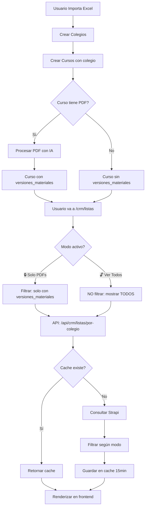

# 📊 FLUJO: Cómo Se Muestran Los Cursos Importados

**Fecha:** 29 de enero de 2026  
**Propósito:** Explicar cómo funciona el sistema de filtrado y visualización

---

## 🔄 FLUJO COMPLETO: Importación → Visualización



---

## 🎯 CÓMO FUNCIONA ACTUALMENTE

### 1. **Al Importar Cursos** (`ImportacionCompletaModal.tsx`)

```typescript
// Línea 1323-1333
const createCursoResponse = await fetch(`/api/crm/colegios/${colegioId}/cursos`, {
  method: 'POST',
  body: JSON.stringify({
    nombre_curso: grupo.curso.nombre,
    nivel,
    grado: String(grado),
    año: grupo.curso.año || new Date().getFullYear(),
    activo: true,
    ...(matricula !== null && !isNaN(matricula) && { matricula }), // ✅ Incluye matrícula
    // ⚠️ NOTA: El curso se asocia al colegio automáticamente por la ruta
  }),
})
```

**Estado del curso después de importar:**
- ✅ Tiene `colegioId` (por la ruta `/colegios/{id}/cursos`)
- ✅ Tiene `matricula` (si venía en el Excel)
- ⚠️ **Puede NO tener** `versiones_materiales` (si no había PDF o falló la descarga)
- ⚠️ **Puede NO tener** campo `colegio` lleno (problema detectado)

---

### 2. **Al Cargar la Página de Listas** (`/crm/listas`)

#### Frontend (`ListasListing.tsx` línea 111-117):

```typescript
const cargarDatos = async (bypassCache = false, forceMostrarTodos?: boolean) => {
  const currentMostrarTodos = forceMostrarTodos !== undefined ? forceMostrarTodos : mostrarTodos
  const cacheBuster = bypassCache ? `&t=${Date.now()}` : ''
  const mostrarTodosParam = currentMostrarTodos ? `&mostrarTodos=true` : ''
  
  const response = await fetch(`/api/crm/listas/por-colegio?${cacheBuster}${mostrarTodosParam}`, {
    signal: controller.signal,
  })
  // ...
}
```

**Modos disponibles:**
1. **🔒 Solo con PDFs** (default): `mostrarTodos=false` o sin parámetro
2. **🔓 Ver Todos**: `mostrarTodos=true`

---

### 3. **En el Backend** (`/api/crm/listas/por-colegio/route.ts`)

#### A. Obtener parámetro (línea 487):
```typescript
const mostrarTodos = request.nextUrl.searchParams.get('mostrarTodos') === 'true'
console.log(`[API] 📋 Modo: ${mostrarTodos ? '🔓 MOSTRAR TODOS' : '🔒 SOLO CON PDFs'}`)
```

#### B. Pre-filtrado (línea 497-514):
```typescript
// Si mostrarTodos=true, NO filtrar (mostrar todos los cursos)
const cursosConVersiones = mostrarTodos ? cursos : cursos.filter((curso: any) => {
  const attrs = (curso as any)?.attributes || curso
  const tienePropiedadEnAttrs = 'versiones_materiales' in attrs
  const tienePropiedadEnCurso = 'versiones_materiales' in curso
  
  if (!tienePropiedadEnAttrs && !tienePropiedadEnCurso) {
    return false // ❌ Excluir si no tiene la propiedad
  }
  
  const versionesRaw = tienePropiedadEnAttrs ? attrs.versiones_materiales : (tienePropiedadEnCurso ? curso.versiones_materiales : null)
  
  // Filtrar null, undefined, arrays vacíos
  if (versionesRaw === null || versionesRaw === undefined) return false
  if (Array.isArray(versionesRaw) && versionesRaw.length === 0) return false
  if (typeof versionesRaw === 'object' && !Array.isArray(versionesRaw) && Object.keys(versionesRaw).length === 0) return false
  
  // Verificar que tenga al menos un PDF
  const versiones = Array.isArray(versionesRaw) ? versionesRaw : [versionesRaw]
  return versiones.some((v: any) => v.pdf_id || v.pdf_url)
})
```

#### C. Filtrado adicional en el loop (línea 598-602):
```typescript
// OPTIMIZACIÓN: Verificar que tenga al menos un PDF antes de procesar
// Si mostrarTodos=true, NO filtrar por PDFs
const tienePDFs = versiones.some((v: any) => v.pdf_id || v.pdf_url)
if (!mostrarTodos && !tienePDFs) {
  continue // ⏭️ Saltar cursos sin PDFs (solo si NO estamos en modo mostrarTodos)
}
```

---

## 🔍 TABLA DE VERDAD: ¿Cuándo Se Muestra un Curso?

| Tiene `colegio` | Tiene `versiones_materiales` | Tiene PDFs | Modo 🔒 Solo PDFs | Modo 🔓 Ver Todos |
|-----------------|------------------------------|------------|-------------------|-------------------|
| ✅ Sí           | ✅ Sí                        | ✅ Sí      | ✅ **SÍ**         | ✅ **SÍ**         |
| ✅ Sí           | ✅ Sí                        | ❌ No      | ❌ **NO**         | ✅ **SÍ**         |
| ✅ Sí           | ❌ No                        | ❌ No      | ❌ **NO**         | ✅ **SÍ**         |
| ❌ No           | ✅ Sí                        | ✅ Sí      | ⚠️ **Depende***   | ⚠️ **Depende***   |
| ❌ No           | ❌ No                        | ❌ No      | ❌ **NO**         | ⚠️ **Depende***   |

**\*Depende:** Si no tiene `colegio`, el backend intenta:
1. Buscar curso similar con `colegio` y crear la relación (línea 655-715)
2. Asignar a colegio con RBD 10479 o 12605 si existe (línea 726-788)
3. Si falla todo, crear grupo "Sin Colegio Asignado" (línea 790-822)

---

## ⚠️ PROBLEMAS ACTUALES DETECTADOS

### 🔴 **PROBLEMA 1: Cursos Sin `colegio` No Aparecen Inmediatamente**

**Síntoma:**  
Importas cursos, vas a `/crm/listas`, activas "Ver Todos", pero no aparecen.

**Causa:**  
1. El curso se crea pero sin el campo `colegio` lleno
2. En el primer request, el backend intenta buscar el colegio pero puede fallar
3. El curso queda "huérfano" temporalmente

**Solución Actual (parcial):**  
- El backend intenta re-asociar al vuelo (línea 694-714)
- Asigna a RBD 10479/12605 si existen (línea 734-788)
- Crea grupo "Sin Colegio Asignado" como último recurso

**Solución Definitiva (recomendada):**  
Validar en la importación que el curso tenga `colegio` asignado:

```typescript
// En ImportacionCompletaModal.tsx, después de crear curso (línea 1338)
if (createCursoResponse.ok && createCursoResult.success) {
  const nuevoCurso = createCursoResult.data
  cursoId = nuevoCurso.documentId || nuevoCurso.id
  
  // ✅ VALIDACIÓN CRÍTICA
  const cursoTieneColegio = nuevoCurso.colegio || 
                            nuevoCurso.attributes?.colegio?.data || 
                            false
  
  if (!cursoTieneColegio) {
    console.error(`❌ CURSO SIN COLEGIO: ${grupo.curso.nombre}`)
    
    // Re-asociar inmediatamente
    await fetch(`/api/crm/cursos/${cursoId}`, {
      method: 'PUT',
      headers: { 'Content-Type': 'application/json' },
      body: JSON.stringify({
        colegio: { connect: [colegioId] }
      })
    })
  }
}
```

---

### 🟡 **PROBLEMA 2: Cache de 15 Minutos**

**Síntoma:**  
Importas cursos, recargas `/crm/listas`, y siguen sin aparecer.

**Causa:**  
El backend cachea la respuesta por 15 minutos (línea 129-139 en `route.ts`).

**Solución Actual:**  
El frontend ya implementa **cache busting** automático:

```typescript
// ListasListing.tsx línea 113
const cacheBuster = bypassCache ? `&t=${Date.now()}` : ''
```

Cuando cambias el modo (🔒 ↔ 🔓), se agrega automáticamente `&t=1738176123456` para forzar una nueva consulta.

**Mejora Recomendada:**  
Agregar botón "🔄 Limpiar Cache":

```typescript
const limpiarCache = async () => {
  try {
    await fetch('/api/crm/listas/por-colegio?cache=false')
    await cargarDatos(true) // Forzar recarga con cache busting
  } catch (e) {
    console.error('Error al limpiar cache:', e)
  }
}
```

---

### 🟢 **PROBLEMA 3: UX Confusa para Usuario**

**Síntoma:**  
El usuario no entiende por qué algunos cursos no aparecen.

**Solución Recomendada:**  
Agregar indicador visual y explicación:

```typescript
// En ListasListing.tsx
{mostrarTodos ? (
  <Alert variant="warning">
    <LuAlertCircle className="me-2" />
    Mostrando <strong>TODOS</strong> los cursos (incluidos sin PDFs).
    Si acabas de importar y no aparecen, espera 5-10 segundos y recarga.
  </Alert>
) : (
  <Alert variant="info">
    <LuLock className="me-2" />
    Mostrando solo cursos <strong>con listas procesadas</strong>.
    Si acabas de importar cursos sin PDFs, activa "Ver Todos" para verlos.
  </Alert>
)}
```

---

## 🎯 RECOMENDACIONES FINALES

### 1. **Validar `colegio` en Importación** (CRÍTICO)
```
Prioridad: 🔴 URGENTE
Tiempo: 1-2h
Impacto: Soluciona el problema principal
```

Agregar validación después de crear cada curso y re-asociar si falta.

---

### 2. **Invalidar Cache Automáticamente Después de Importar** (ALTO)
```
Prioridad: 🟡 ALTO
Tiempo: 30min
Impacto: Mejora UX significativamente
```

```typescript
// En ImportacionCompletaModal.tsx, después de finalizar (línea 2300)
} finally {
  setProcessing(false)
  
  // ✅ Invalidar cache automáticamente
  try {
    await fetch('/api/crm/listas/por-colegio?cache=false')
    console.log('[Importación] ✅ Cache invalidado')
  } catch (e) {
    console.warn('[Importación] ⚠️ No se pudo invalidar cache:', e)
  }
  
  // ... resto del código ...
}
```

---

### 3. **Agregar Feedback Visual** (MEDIO)
```
Prioridad: 🟢 MEDIO
Tiempo: 30min
Impacto: Mejora comprensión del usuario
```

Agregar alertas explicativas según el modo activo.

---

### 4. **Botón "Recién Importados"** (OPCIONAL)
```
Prioridad: 🟢 BAJO
Tiempo: 1h
Impacto: Facilita verificación rápida
```

```typescript
// Agregar filtro temporal que muestre solo cursos de los últimos 5 minutos
const [mostrarRecientes, setMostrarRecientes] = useState(false)

// En el backend:
if (mostrarRecientes) {
  const hace5min = new Date(Date.now() - 5 * 60 * 1000)
  cursosConVersiones = cursosConVersiones.filter((curso: any) => {
    const createdAt = new Date(curso.createdAt || curso.attributes?.createdAt)
    return createdAt > hace5min
  })
}
```

---

## 📊 RESUMEN: Cómo Ver Cursos Recién Importados

### Paso a Paso Actual:

1. ✅ Importar Excel desde `/crm/listas` → "Importación Completa"
2. ✅ Esperar a que termine (aparece "Importación completada")
3. ✅ Ir a `/crm/listas`
4. ✅ **Hacer clic en "🔓 Ver Todos"** (botón amarillo)
5. ✅ **Esperar 10-15 segundos** mientras carga
6. ✅ Buscar tu colegio por RBD o nombre
7. ✅ Verificar que:
   - Aparece el colegio
   - Aparece la cantidad de listas
   - Aparece la matrícula total (si había datos en Excel)

### Checklist de Troubleshooting:

- [ ] Activé "Ver Todos" (botón amarillo)
- [ ] Esperé al menos 10-15 segundos
- [ ] Revisé el debug: `/debug/importacion`
- [ ] Verifiqué que los cursos tengan `colegio` en los logs
- [ ] Revisé el JSON directo: `/debug/listas?mostrarTodos=true`
- [ ] Probé limpiar cache manualmente: `?cache=false&t=12345`

---

**Estado Actual:** Funcional con limitaciones  
**Estado Objetivo:** Funcional sin limitaciones  
**Tiempo para llegar:** 2-3 horas de correcciones críticas
