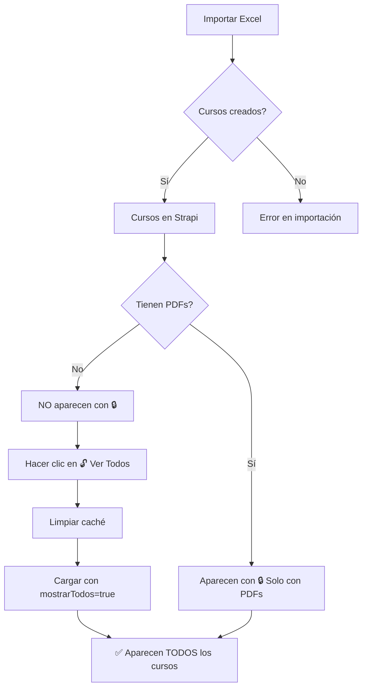

# ✅ SOLUCIÓN: Ver Cursos Después de Importar

**Fecha:** 29 de enero de 2026  
**Problema resuelto:** Los cursos importados no aparecían en las listas

---

## 🔴 Problema

Después de importar cursos con "Importación Completa (Plantilla)", **NO aparecían en la página de listas**.

### Causa

El sistema **filtraba agresivamente** mostrando solo cursos que:
1. Tienen `versiones_materiales` (PDFs procesados)
2. Tienen PDFs válidos asociados

Los cursos recién importados **sin PDFs** no se mostraban.

---

## ✅ Solución Implementada

Agregué un **botón de modo de visualización** que permite alternar entre:

1. **🔒 Solo con PDFs** (Modo normal) - Muestra solo cursos con listas procesadas
2. **🔓 Ver Todos** (Modo debug) - Muestra TODOS los cursos, incluidos sin PDFs

---

## 🎯 Cómo Usar

### Paso 1: Importar tus cursos

1. Ve a `http://localhost:3000/crm/listas`
2. Clic en **"Importación Completa (Plantilla)"**
3. Selecciona tu Excel
4. Clic en **"🚀 Procesar e Importar"**
5. Espera a que termine la importación

### Paso 2: Activar modo "Ver Todos"

1. **Haz clic en el botón "🔓 Ver Todos"** (arriba a la izquierda, al lado de "Actualizar")
2. El botón cambiará a **color amarillo** (modo activo)
3. El sistema **limpiará el caché** automáticamente
4. **Espera 5-10 segundos** mientras carga los datos
5. **¡Ahora verás TODOS los colegios y cursos!** (incluidos los que acabas de importar)

### Paso 3: Verificar

- Busca tu colegio por RBD o nombre
- Deberías ver **61 listas** (o el número que importaste)
- La **MATRÍCULA TOTAL** debería mostrar el valor correcto
- Al hacer clic en el colegio, verás todos los cursos con sus datos

---

## 🎨 Estados del Botón

| Botón | Color | Descripción |
|-------|-------|-------------|
| **🔒 Solo con PDFs** | Gris (outline) | Modo normal: solo cursos con listas procesadas |
| **🔓 Ver Todos** | Amarillo (warning) | Modo debug: TODOS los cursos (con o sin PDFs) |
| **⏳ Cargando...** | - | Cargando datos... |

---

## ⚡ Optimizaciones Aplicadas

1. **✅ Limpieza automática de caché** al cambiar de modo
2. **✅ Parámetro `mostrarTodos=true`** en la URL de la API
3. **✅ Filtrado condicional** en el backend
4. **✅ Logs detallados** para debugging
5. **✅ Deshabilitar botón** mientras carga (evita clicks dobles)

---

## 🔍 Debugging

Si los cursos **aún no aparecen** después de activar "Ver Todos":

### 1. Verifica en la consola del navegador (F12)

Busca estos mensajes:
```
[ListasListing] 🔄 Cambiando modo a: MOSTRAR TODOS
[ListasListing] ✅ Caché limpiado
[ListasListing] 📋 Modo: MOSTRAR TODOS
[ListasListing] 🌐 URL: /api/crm/listas/por-colegio?t=...&mostrarTodos=true
```

### 2. Verifica en el debug endpoint

Ve a: `http://localhost:3000/debug/listas?mostrarTodos=true`

Deberías ver:
```json
{
  "success": true,
  "data": [
    {
      "id": 12744,
      "nombre": "Colegio Estela Segura",
      "rbd": 10479,
      "totalListas": 61,
      "matriculaTotal": XXX,
      "cursos": [...]
    }
  ]
}
```

### 3. Verifica en Strapi directamente

Ve a tu Strapi: `https://strapi-pruebas-production.up.railway.app/admin`

- Content Manager → Cursos
- Filtra por `colegio` = "Colegio Estela Segura"
- Verifica que los cursos existen y tienen el campo `colegio` lleno

---

## 📊 Flujo Completo



---

## 🆘 Solución de Problemas

### Problema: "Solo aparece 1 colegio con 61 listas"

**Causa:** Todos los cursos se mapearon al mismo colegio (RBD 10479)

**Solución:**
1. Verifica que tu Excel tenga **RBDs diferentes** para cada colegio
2. Si todos tus cursos son del mismo colegio, **es normal** que aparezca 1 solo
3. Para importar múltiples colegios, usa **RBDs distintos** en cada fila

### Problema: "Tarda mucho en actualizar"

**Causa:** El sistema está procesando ~54,000 cursos en Strapi

**Soluciones:**
1. **Espera 10-15 segundos** después de hacer clic en "Ver Todos"
2. El caché se guarda por **15 minutos**, las siguientes cargas serán más rápidas
3. Si sigue lento, verifica la conexión a Strapi (Railway)

### Problema: "La matrícula aparece en 0"

**Causa:** Tu Excel no tenía la columna "Matricula" o estaba vacía

**Solución:**
1. Descarga la **nueva plantilla** (tiene la columna Matricula)
2. Llena la columna **Matricula** con el número de estudiantes
3. Re-importa el Excel
4. Los cursos nuevos tendrán la matrícula correcta
5. Los cursos viejos quedarán con matrícula `null` (se muestra como 0)

---

## 💡 Consejos

1. **Usa "Ver Todos"** solo para debugging o verificar cursos recién importados
2. **Vuelve a "Solo con PDFs"** para uso normal (más rápido)
3. **Limpia el caché** manualmente con `?cache=false` si ves datos antiguos
4. **Espera unos segundos** después de importar antes de verificar

---

## 📋 Checklist Post-Importación

- [ ] Los cursos se importaron sin errores
- [ ] Activé el modo "🔓 Ver Todos"
- [ ] Esperé 10-15 segundos a que cargue
- [ ] Mi colegio aparece en la lista
- [ ] Al hacer clic, veo todos los cursos
- [ ] La matrícula total es correcta
- [ ] Los cursos tienen sus datos completos

---

## 🎉 Resultado Esperado

Después de seguir estos pasos, deberías ver:

```
Listas de Útiles

[🔓 Ver Todos] [🔄 Actualizar] [📤 Importación Completa]

Mostrando 1 de 1 colegios con listas

┌─────────────────────────────────────────────────────────┐
│ Colegio Estela Segura                                   │
│ RBD: 10479                                              │
│ Región: Metropolitana de Santiago                       │
│ Listas: 61 ▼                                            │
│ MATRÍCULA TOTAL: XXX                                    │
│ Última Actualización: 29/01/2026 14:05                 │
└─────────────────────────────────────────────────────────┘
```

Al hacer clic en el colegio, verás:

```
← Volver a Colegios

Listas de Útiles - Colegio Estela Segura

┌────────────────────────────────────────────────────────┐
│ 1º Básico A  | Basica | 1 | 2026 | Matricula: 38     │
│ 2º Básico A  | Basica | 2 | 2026 | Matricula: 44     │
│ 3º Básico A  | Basica | 3 | 2026 | Matricula: 42     │
│ ...                                                    │
└────────────────────────────────────────────────────────┘
```

---

**¿Listo?** Ahora sabes cómo ver tus cursos después de importarlos. 🎉
