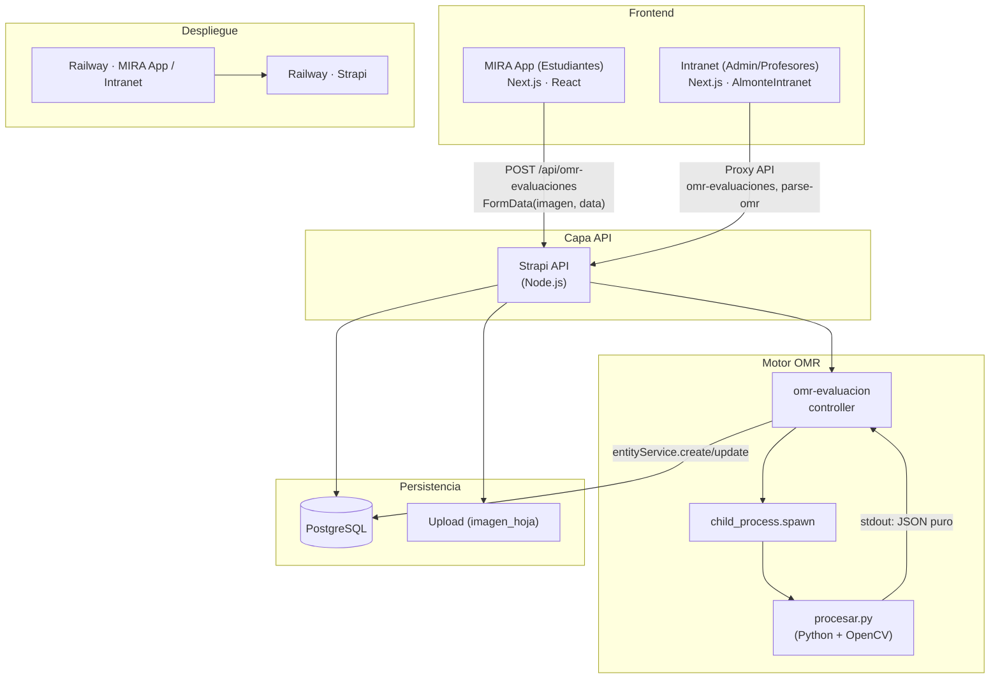

# Documentación Técnica Exhaustiva y Post-Mortem del Proyecto MIRA

**Rol:** Lead Software Architect & Senior Technical Writer  
**Fecha:** Post-fase de desarrollo  
**Estado:** Documento maestro de ingeniería — confidencial interno  

---

# 1. Resumen Ejecutivo (Executive Summary)

## 1.1 Qué es el ecosistema MIRA

**MIRA** es una plataforma educativa integral que conecta a **estudiantes**, **profesores** y **administradores** en un flujo único de evaluación y seguimiento. El ecosistema se compone de **cuatro pilares técnicos**:

| Componente | Descripción | Stack principal |
|------------|-------------|-----------------|
| **MIRA App (Estudiantes)** | Aplicación Next.js para alumnos: registro, login, dashboard de evaluaciones, escaneo de hojas OMR desde móvil/PC y revisión post-escaneo antes de publicar. | Next.js, React, Tailwind, Framer Motion, localStorage |
| **Intranet (Admin / Profesores)** | Panel de administración y docentes: colegios, cursos, asignación de docentes, licencias, **Asignar Libros a MIRA**, creación de evaluaciones (hoja maestra), listado y carga de evaluaciones OMR, analíticas, gestión multimedia, profesores. | Next.js (AlmonteIntranet), mismo repo, rutas bajo `(admin)/(apps)/mira/` |
| **Backend Strapi** | API central: content types (persona-mira, libro-mira, omr-evaluacion, evaluacion, colegio, curso, etc.), registro y login de estudiantes, permisos públicos/autenticados, **orquestación del motor OMR**. | Strapi v5, Node.js, PostgreSQL, draftAndPublish |
| **Motor Evaluador OMR** | Pipeline de visión por computadora que, a partir de una foto de la hoja de respuestas, devuelve RUT, código de evaluación y respuestas (1–80) en un contrato JSON. Ejecutado como **child process** desde Strapi. | Python 3, OpenCV (cv2), NumPy, `procesar.py` |

La **Intranet** y la **MIRA App** pueden coexistir en el mismo monorepo (AlmonteIntranet para admin; **MIRA-Almonte** como app estudiantes en otro repositorio o módulo) según la organización del equipo. La documentación de flujos de registro/login referencia explícitamente **MIRA-Almonte** como frontend de estudiantes.

## 1.2 Impacto de la plataforma

- **Estudiantes:** Registro con confirmación de email, login sin depender de `up_users`, recuperación de contraseña; acceso a **Libros MIRA** y **Evaluaciones institucionales**; subida de foto de la hoja OMR y **revisión antes de publicar** (draft → confirmar → publicado).
- **Profesores/Admin:** CRUD de establecimientos, cursos, asignación de docentes, **asignar libros a MIRA** (relación libro base ↔ libro-mira, flag `tiene_omr`), creación de evaluaciones con hoja maestra, listado y carga de evaluaciones OMR, analíticas y gestión multimedia.
- **Sistema:** Un único motor OMR reutilizable (Strapi + `procesar.py`) sirve tanto la carga desde Intranet como la subida desde la app estudiantes; el resultado se guarda en PostgreSQL vía Strapi y, si aplica, se cruza con pautas de corrección automática.

---

# 2. Arquitectura de Sistemas (Diagramas)

## 2.1 Diagrama de arquitectura general (Mermaid)



## 2.2 Flujo de la foto de la evaluación (del alumno al 7.0)

```mermaid
sequenceDiagram
    participant U as Usuario (Estudiante)
    participant FE as MIRA App (Next.js)
    participant API as Strapi API
    participant CP as Child Process
    participant PY as procesar.py
    participant DB as PostgreSQL

    U->>FE: Selecciona/toma foto de la hoja
    FE->>FE: Preview (FileReader) + validación
    U->>FE: "Enviar evaluación"
    FE->>API: POST /api/omr-evaluaciones (FormData: data + files.imagen_hoja)
    API->>API: formidable parse multipart
    API->>API: Subida de imagen (upload service)
    API->>CP: spawn(python3, [procesar.py, ruta_imagen])
    CP->>PY: Ejecución

    Note over PY: 1. Fiduciales → warp<br/>2. ROIs (Código, RUT, Respuestas)<br/>3. findContours → burbujas<br/>4. Fill % → marcadas<br/>5. JSON a stdout

    PY-->>CP: stdout: {"respuestas":{...},"rut":"...","codigo":"..."}
    CP-->>API: JSON string
    API->>API: Parse JSON, corrección automática (pauta) si aplica
    API->>DB: entityService.create (DRAFT, sin publishedAt)
    API-->>FE: 201 { data: { documentId, rut, codigo_evaluacion, resultados, ... } }

    FE->>FE: showReview = true → ReviewScanResult
    U->>FE: Revisa/edita RUT y respuestas
    U->>FE: "Confirmar y continuar" / "Guardar cambios"
    FE->>API: PUT /api/omr-evaluaciones/:id { data: { publishedAt, rut?, resultados? } }
    API->>DB: entityService.update (publicar + campos editados)
    API-->>FE: 200
    FE->>FE: Redirección a dashboard/libro o dashboard
    Note over U,DB: Registro publicado; corrección automática (si hay pauta) ya guardada en resultados → "7.0" y métricas disponibles.
```

---

# 3. Desglose por Sprints (Historial de Desarrollo)

## 3.1 Sprint 1: Auth y Legales

**Objetivo:** Registro y login de estudiantes y profesores con validación estricta y, donde aplique, aceptación de términos y privacidad.

**Implementación relevante:**

- **Registro estudiante (Strapi):**
  - **Ruta:** `POST /api/registro-estudiante`.
  - **Controller:** `strapi/src/api/registro-estudiante/controllers/registro-estudiante.ts` — `registrar(ctx)`.
  - Validación de body: nombres, apellido, RUT, email, password (mín. 6 caracteres).
  - **CASO A:** Usuario ya existente en `up_users` + Persona → upgrade a estudiante (crear persona-mira, JWT de users-permissions).
  - **CASO B:** Usuario nuevo → crear Persona + Persona-mira (inactivo), `confirmationToken`, envío de email de activación; contraseña y token persistidos vía `db.query` (bcrypt) para evitar que entityService omita campos privados.
- **Login estudiante:** `POST /api/personas-mira/auth/login` (sin depender de up_users para CASO B).
- **Confirmación de email:** `GET /api/personas-mira/auth/confirm?token=...` — activación de cuenta.
- **Recuperación de contraseña:** `forgot-password` y `reset-password-token` documentados en `docs/FLUJO_ESTUDIANTE_REGISTRO_LOGIN_RECUPERACION.md`.
- **Frontend (MIRA-Almonte):** Rutas API proxy (ej. `src/app/api/auth/register-estudiante/route.ts`) que reenvían a Strapi; el cliente no expone el token de Strapi.

**Legales:** En el código explorado del workspace (Intranet/AlmonteIntranet) no aparecen modales dedicados de **Términos y Condiciones** ni **Política de Privacidad**; las referencias a "términos" son de búsqueda/normalización en listas CRM o atributos WooCommerce. Si en la app estudiantes (MIRA-Almonte) existen modales de aceptación de términos/privacidad en registro, quedan como parte del flujo UX de ese frontend y no del repo Intranet/Strapi analizado aquí.

---

## 3.2 Sprint 2: Dashboard UX/UI

**Objetivo:** Separar y presentar claramente las **Evaluaciones globales (Libros MIRA)** —agrupadas por capítulo/libro— de las **Evaluaciones institucionales** (Pruebas del colegio).

**Implementación:**

- **Dashboard estudiantes (MIRA App):**
  - Estructura típica: sección "Libros MIRA" (acordeones por libro/capítulo) y sección "Pruebas del colegio" o equivalente.
  - Rutas de escaneo OMR diferenciadas: por ejemplo `dashboard/libro/[id]/omr` (libro MIRA) y `dashboard/evaluaciones/[id]/omr` (evaluación institucional).
- **Flujo post-escaneo unificado:** Tras el POST a Strapi, el frontend no redirige de inmediato; muestra la pantalla de **revisión** (`ReviewScanResult`) con RUT, código de evaluación y respuestas detectadas, permite editar RUT y respuestas, y solo al **Confirmar / Guardar cambios** se envía el PUT con `publishedAt` y datos editados.
- **Intranet:** El menú MIRA (en `AlmonteIntranet/src/layouts/components/data.ts`) incluye: Establecimientos (`/mira/colegios`), Cursos (`/mira/cursos`), Asignación de Docentes (`/mira/asignaciones`), Licencias de libros (`/mira/licencias`), Evaluaciones OMR (`/mira/evaluaciones-omr`), Crear evaluación (Hoja Maestra) (`/mira/evaluaciones/crear`), **Asignar Libros a MIRA** (`/mira/libros-mira`), Analíticas (`/mira/analiticas`), Gestión Multimedia (`/mira/recursos`), Profesores (`/mira/profesores`).

---

## 3.3 Sprint 3: Upselling Marketplace (Tienda)

**Objetivo:** Preparación conceptual e interfaz de **Tienda** para descubrir nuevos libros MIRA (diseño vía IA).

**Implementación en el workspace:**

- Rutas bajo `AlmonteIntranet/src/app/tienda/`: productos, pedidos, POS, mi-cuenta, facturas, etc.
- APIs en `AlmonteIntranet/src/app/api/tienda/` (productos, pedidos, upload, precios, clientes, categorías, obras, etc.).
- La **Tienda** es el módulo donde se puede exponer el catálogo de libros y ofrecer “descubrir” o comprar/activar libros MIRA; la integración con el módulo MIRA (libros-mira, licencias) se hace vía Strapi y APIs propias.

---

## 3.4 Sprint 4: Intranet Admin — CRUD “Asignar Libros a MIRA”

**Objetivo:** CRUD completo para asignar libros del catálogo a MIRA (entidad libro-mira) con relación a asignaturas y flag OMR.

**Implementación:**

| Concepto | Ruta o archivo |
|----------|-----------------|
| Listado | `(admin)/(apps)/mira/libros-mira/page.tsx` → `LibrosMiraListing.tsx` |
| Detalle / Edición | `mira/libros-mira/[libroMiraId]/page.tsx` → `LibroMiraDetails.tsx` |
| Crear (asignar) | `mira/libros-mira/crear/page.tsx` → `CrearLibroMiraForm.tsx` |
| API listar/crear | `src/app/api/mira/libros-mira/route.ts` |
| API por id | `src/app/api/mira/libros-mira/[id]/route.ts` |
| API libros base (catálogo) | `src/app/api/mira/libros-base/route.ts` |
| Menú | `layouts/components/data.ts` — label **"Asignar Libros a MIRA"**, url `/mira/libros-mira` |

Campos relevantes: relación a **libro** (base), **tiene_omr**, **documentId**; enlaces y borrado usan `documentId` o `id` según la API de Strapi v5.

---

## 3.5 Sprint 5: El Motor OMR (La joya de la corona)

**Objetivo:** Sustituir el script antiguo por un pipeline estable que: enderece la hoja, extraiga ROIs, detecte burbujas, aplique fill detection y devuelva un **único JSON** por stdout para que Strapi no dependa de logs ni de salidas mixtas.

**Archivo principal:** `strapi/scripts/procesar.py`.  
**Contrato de salida (stdout):**  
`{"respuestas": {"1": "A", "2": "B", ...}, "rut": "12345678-K", "codigo": "012345678"}`  
En caso de error: `{"error": "...", "respuestas": {...}, "rut": "", "codigo": ""}`.  
Los logs de diagnóstico van a **stderr** (`log()` escribe en `sys.stderr`).

### a) Warp Perspective (enderezado con fiduciales)

- **Entrada:** Imagen en BGR (OpenCV).
- **Detección de fiduciales:** 4 cuadrados negros en las esquinas. Se usa umbral fijo 80, morfología (MORPH_CLOSE 7×7), `findContours` (RETR_EXTERNAL). Filtros por área (0.05%–3% del área total), relación de aspecto (0.5–2.0) y solidez (>0.5). Se asignan los 4 candidatos a las esquinas de la imagen por proximidad (≤35% de la diagonal).
- **Salida:** `warpPerspective` con destino **igual a dimensiones originales** (`w_orig`, `h_orig`). En scripts de prueba/calibración (p. ej. `test_warp.py`) se usan tamaños fijos como **5667×7334**; en `procesar.py` el canvas warpeado mantiene el tamaño de la imagen de entrada para que los ROIs en fracciones sigan siendo válidos.

### b) Extracción de ROIs (Código, RUT, Respuestas)

- ROIs definidos como **fracciones del canvas warpeado** (calibradas con `calibrar_rois.py` sobre canvas **5667×7334** px):

| ROI | Fracción (x_ini, y_ini, x_fin, y_fin) | Descripción |
|-----|----------------------------------------|-------------|
| **Código** | (0.6611, 0.0509, 0.8925, 0.2450) | 9 columnas × 10 filas (90 burbujas) |
| **RUT**    | (0.6611, 0.2874, 0.8925, 0.5004) | 9 columnas (8×10 + 1×11 con 'K') = 91 burbujas |
| **Respuestas** | (0.0888, 0.5570, 0.9174, 0.9595) | 4 columnas × 20 filas × 5 opciones = 400 burbujas |

```python
ROI_CODIGO_FRAC = (0.6611, 0.0509, 0.8925, 0.2450)
ROI_RUT_FRAC    = (0.6611, 0.2874, 0.8925, 0.5004)
ROI_RESP_FRAC   = (0.0888, 0.5570, 0.9174, 0.9595)
```

- `frac_to_pixel(frac_bounds, w, h)` convierte a píxeles y recorta los tres crops (código, RUT, respuestas) en escala de grises para las siguientes etapas.

### c) Mapeo espacial (findContours, grillas de burbujas)

- **Detección de burbujas:** `detectar_burbujas(image)` — GaussianBlur 5×5, `adaptiveThreshold` (GAUSSIAN_C, block 71, C 12), `findContours` (RETR_EXTERNAL). Filtros: área 2000–20000 px², relación de aspecto 0.65–1.55, circularidad ≥0.55.
- **Número esperado de burbujas:**
  - **Código:** 90 (9 columnas × 10 filas).
  - **RUT:** 91 (8 columnas × 10 filas + 1 columna × 11 filas para 0–9 y 'K').
  - **Respuestas:** 400 (4 columnas × 20 filas × 5 alternativas A–E).
- **Ordenación:** Por `cx`/`cy` y separación por gaps para columnas; dentro de cada columna, filas por `cy`. Se construyen diccionarios de grilla (por columna/fila o por número de pregunta y letra) para asociar cada burbuja a un dígito, letra RUT o respuesta.

### d) Fill detection (umbral de densidad de píxeles)

- **Umbral de gris:** `DARK_PIXEL_THRESHOLD = 150` — por debajo se considera píxel “oscuro”.
- **Umbral de relleno:** `FILL_PERCENT_THRESHOLD = 35.0` (%) mínimo de píxeles oscuros dentro de un círculo (máscara) centrado en la burbuja para considerarla **marcada**.
- Cálculo: `calcular_fill(gray_crop, bubble)` recorta el ROI de la burbuja, aplica máscara circular y cuenta `(roi < 150)` dentro de la máscara; se devuelve el porcentaje.
- **Reglas de lectura:** Una sola burbuja marcada → valor (dígito, "K", A–E); más de una → `"M"` (doble marca); ninguna → vacío.

### e) Contrato JSON (stdout limpio vs stderr)

- **Una sola salida útil:** Al final del pipeline, `print(json.dumps(out))` — un único JSON por ejecución.
- **Errores:** Excepciones capturadas; se imprime JSON con clave `"error"` y el resto de claves con valores por defecto; el detalle se escribe en stderr con `log()`.
- Strapi lee **solo stdout**, extrae el primer `{...}` válido y parsea; si existe `resultadosReales.error`, marca el registro como estado `"error"` y guarda el mensaje en `resultados.error_omr`.

---

## 3.6 Sprint 6: Deploy y Railway

**Objetivo:** Despliegue estable en Railway (Intranet y/o MIRA App y Strapi) y evitar timeouts en el arranque.

**Intranet / MIRA App (Railway):**

- **Configuración:** `railway.json` en raíz: builder DOCKERFILE, `rootDirectory: "AlmonteIntranet"`, `startCommand: "node server.js"`, `healthcheckPath: "/api/health"`, `healthcheckTimeout: 300`.
- **Dockerfile:** En `AlmonteIntranet/Dockerfile` (rutas relativas al rootDirectory): `npm ci`, build de Next.js, `node server.js`.
- **Variables críticas:** `NEXT_PUBLIC_STRAPI_URL`, `STRAPI_API_TOKEN`, etc. (ver `docs/CONFIGURACION.md`).

**Strapi en Railway (502 Bad Gateway / timeout):**

- El **bootstrap** de Strapi (`strapi/src/index.ts`) realiza una cantidad grande de operaciones antes de que el servidor esté “listo”: comprobación y ALTER de columnas en `up_users`, `ensureContentManagerMainFields`, asignación masiva de permisos (Public y Authenticated) para persona-mira, libro-mira, omr-evaluacion, evaluacion, upload, rfq, empresa, libro, cotizacion, etc. Eso implica muchas consultas a la BD y lógica síncrona/asíncrona que puede **alargar el tiempo de arranque** por encima del límite que Railway (o el proxy) permite para la primera respuesta.
- **Solución típica:** Reducir o diferir la carga del bootstrap en producción (p. ej. no ejecutar todas las comprobaciones/permisos en cada arranque, o mover permisos a migraciones/seed). Así se evita el 502 por timeout durante el bootstrap. El bootstrap incluye además: workaround content-api, interceptor entityService.count, permisos omr-evaluacion.create y .update públicos, LMS, módulo de compras, confirmación de email, usuario y datos de prueba.

**Motor OMR en producción:**

- Strapi busca `procesar.py` en varias rutas: `process.cwd()/scripts/procesar.py`, `process.cwd()/strapi/scripts/procesar.py`, `__dirname/../../../../scripts/procesar.py`, `/app/strapi/scripts/procesar.py`, `/app/scripts/procesar.py`.
- Python: `python3` o `/app/.venv/bin/python3` si existe.
- **LD_LIBRARY_PATH:** Se lee desde archivos `.omr_ld_path` o se usa `/app/lib` si existe `libstdc++.so.6` (numpy/opencv en Nixpacks/Railway).

---

# 4. Análisis Técnico del OMR (Visión por Computadora)

## 4.1 Desafíos técnicos superados

| Desafío | Enfoque en MIRA |
|--------|------------------|
| **Imágenes borrosas o con sombras** | GaussianBlur antes del umbral; `adaptiveThreshold` (GAUSSIAN_C, block 71) para adaptarse a variaciones locales de iluminación. |
| **Ruido en hojas vacías** | Umbral de relleno al **35%** de píxeles oscuros dentro del círculo de la burbuja; evita marcar burbujas vacías que por ruido o sombra superen un umbral bajo (p. ej. ~2.4% en pruebas). |
| **Doble marca o sin marca** | Una burbuja marcada → valor; más de una en la misma columna/pregunta → `"M"`; ninguna → vacío. El contrato JSON siempre devuelve 80 respuestas (claves "1"–"80") y RUT/código consistentes. |
| **Fiduciales no detectados** | Criterios geométricos (área, relación de aspecto, solidez) y asignación por proximidad a esquinas; si no se encuentran 4 candidatos, el script devuelve JSON con `"error"` y stderr explicativo. |
| **Burbujas mal contadas** | Si el número de burbujas detectadas no coincide con el esperado (90, 91, 400), se registra WARN en stderr pero se intenta mapear con las disponibles; la grilla puede quedar parcial y la lectura ser incompleta. |

## 4.2 Parámetros clave (procesar.py)

```text
DARK_PIXEL_THRESHOLD   = 150
FILL_PERCENT_THRESHOLD = 35.0
EXPECTED_CODIGO = 90
EXPECTED_RUT    = 91
EXPECTED_RESP   = 400
```

## 4.3 Integración Strapi ↔ Python

- **Formato de request:** Multipart con `data` (JSON string: estudiante, libro_mira, codigo_evaluacion_seleccionada, etc.) y `files.imagen_hoja`.
- **Ejecución:** `spawn(pythonCmd, [scriptPath, imagePathToProcess], { env })`; stdout y stderr se capturan por eventos.
- **Parseo:** Se toma la primera subcadena `{...}` en stdout y se parsea como JSON; si hay clave `error`, el registro se guarda como draft con estado `"error"` y el mensaje en `resultados.error_omr`.
- **Corrección automática:** Si el procesamiento fue exitoso, hay libro_mira y código de evaluación leído; Strapi busca en `api::evaluacion.evaluacion` (por libro_mira) una forma cuya `codigo_evaluacion` coincida y aplica la pauta de respuestas para calcular correctas/incorrectas/omitidas y guardar `resultados.correccion_automatica`.

---

# 5. Tech Stack

## 5.1 Frontend (MIRA App e Intranet)

| Tecnología | Uso |
|------------|-----|
| **Next.js** | App Router, rutas API, SSR/CSR |
| **React** | Componentes, hooks (useState, useEffect, useMemo, useRouter, useParams, useSearchParams) |
| **Tailwind CSS** | Estilos, responsive, utilidades |
| **Framer Motion (motion/react)** | Animaciones en ReviewScanResult y componentes de revisión OMR |
| **Lucide React** | Iconos |
| **TypeScript** | Tipado en todo el frontend |

## 5.2 Backend (Strapi)

| Tecnología | Uso |
|------------|-----|
| **Strapi v5** | CMS headless, content-types, entityService, draftAndPublish |
| **Node.js** | Runtime |
| **PostgreSQL** | Base de datos principal |
| **formidable** | Parse de multipart en controller OMR cuando body no viene parseado |
| **child_process (spawn)** | Ejecución de `procesar.py` |
| **bcrypt** | Hash de contraseñas (registro estudiante, etc.) |

## 5.3 Motor OMR

| Tecnología | Uso |
|------------|-----|
| **Python 3** | Lenguaje del script |
| **OpenCV (cv2)** | Lectura de imagen, filtros, findContours, warpPerspective, recortes, máscaras |
| **NumPy** | Arrays, ordenación de puntos, operaciones numéricas |
| **json, sys, os** | Contrato stdout, stderr, rutas |

## 5.4 Infraestructura y despliegue

| Tecnología | Uso |
|------------|-----|
| **Railway** | Hosting de frontend (Intranet / MIRA App) y de Strapi |
| **Docker** | Imagen de build para Next.js (AlmonteIntranet) |
| **Git** | Control de versiones (repos Intranet, Strapi.1630, y si aplica Mira-Almonte) |

---

# 6. Referencias de código clave

## 6.1 Contrato JSON del OMR (ejemplo)

```json
{
  "respuestas": {
    "1": "A",
    "2": "B",
    "3": "C",
    "4": "D",
    "5": "E",
    "6": "",
    "7": "M",
    "...": "..."
  },
  "rut": "12345678-K",
  "codigo": "012345678"
}
```

## 6.2 Content-type omr-evaluacion (schema)

- **collectionName:** `omr_evaluaciones`
- **draftAndPublish:** `true` — creación como draft; publicación al confirmar desde la app (PUT con `publishedAt`).
- **Atributos:** estudiante (relation persona-mira), libro_mira (relation libro-mira), imagen_hoja (media), fecha_procesamiento, estado (pendiente | procesado | error), resultados (JSON), rut, codigo_evaluacion, notas.

## 6.3 Rutas Strapi utilizadas por el flujo OMR

| Acción | Método | Ruta |
|--------|--------|------|
| Crear (subir foto + procesar) | POST | `/api/omr-evaluaciones` |
| Actualizar (publicar + editar) | PUT | `/api/omr-evaluaciones/:documentId` |
| Listar / filtrar | GET | `/api/omr-evaluaciones` |
| Obtener uno | GET | `/api/omr-evaluaciones/:id` |

---

---

# 7. Resumen de archivos críticos por componente

| Componente | Archivo o ruta principal |
|------------|---------------------------|
| **Motor OMR** | `Strapi.1630/strapi/scripts/procesar.py` |
| **Controller OMR** | `Strapi.1630/strapi/src/api/omr-evaluacion/controllers/omr-evaluacion.ts` |
| **Schema OMR** | `Strapi.1630/strapi/src/api/omr-evaluacion/content-types/omr-evaluacion/schema.json` |
| **Bootstrap / permisos** | `Strapi.1630/strapi/src/index.ts` |
| **Registro estudiante** | `Strapi.1630/strapi/src/api/registro-estudiante/` |
| **Login persona-mira** | `Strapi.1630/strapi/src/api/persona-mira/` (auth) |
| **Flujo auth (doc)** | `Strapi.1630/docs/FLUJO_ESTUDIANTE_REGISTRO_LOGIN_RECUPERACION.md` |
| **Intranet MIRA menú** | `Intranet/AlmonteIntranet/src/layouts/components/data.ts` |
| **CRUD Libros MIRA** | `Intranet/AlmonteIntranet/src/app/(admin)/(apps)/mira/libros-mira/` |
| **APIs Libros MIRA** | `Intranet/AlmonteIntranet/src/app/api/mira/libros-mira/` |
| **Evaluaciones OMR (admin)** | `Intranet/AlmonteIntranet/src/app/(admin)/(apps)/mira/evaluaciones-omr/` |
| **API OMR (proxy)** | `Intranet/AlmonteIntranet/src/app/api/mira/omr-evaluaciones/route.ts` |
| **Deploy Railway** | `Intranet/docs/DEPLOYMENT.md`, `railway.json`, `AlmonteIntranet/Dockerfile` |

**Nota sobre MIRA App (estudiantes):** La app de estudiantes (por ejemplo **Mira-Almonte** en otro repositorio) contiene: login/registro, dashboard con evaluaciones globales (Libros MIRA) e institucionales, páginas de escaneo OMR (`dashboard/libro/[id]/omr`, `dashboard/evaluaciones/[id]/omr`) y el componente **ReviewScanResult** (revisión post-escaneo con edición de RUT/respuestas y confirmación que dispara el PUT con `publishedAt`). La documentación de flujos de auth referencia `MIRA-Almonte` como frontend que consume las APIs de Strapi.

---

*Documento generado a partir del análisis del código y de la documentación existente en los repositorios Intranet y Strapi.1630, y del historial de desarrollo descrito en las sesiones de trabajo. Para ampliar el flujo de registro/login/recuperación de estudiantes, consultar `Strapi.1630/docs/FLUJO_ESTUDIANTE_REGISTRO_LOGIN_RECUPERACION.md`.*
